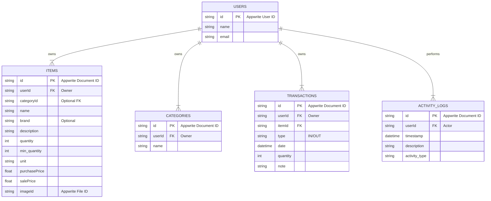

#### 3.4.3 Diagram ERD (Konseptual untuk Appwrite)
*Catatan: Ini adalah representasi konseptual. Di Appwrite, relasi diimplementasikan melalui ID yang disimpan, dan keamanan diatur oleh **Document-Level Permissions**.*

