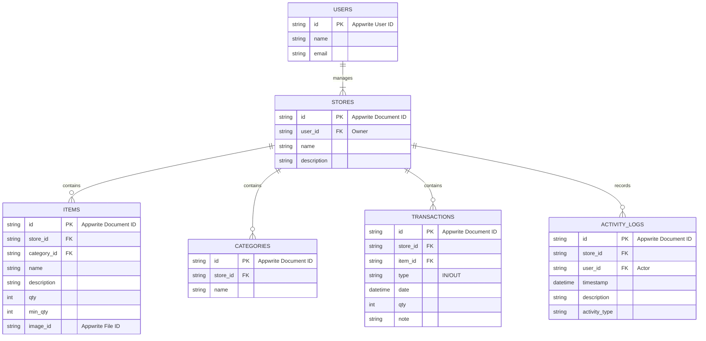

#### 3.4.3 Diagram ERD (Konseptual untuk Appwrite)
*Catatan: Ini adalah representasi konseptual. Di Appwrite, relasi diimplementasikan melalui ID dokumen yang disimpan, dan keamanan diatur oleh Aturan Akses (Permissions).*

